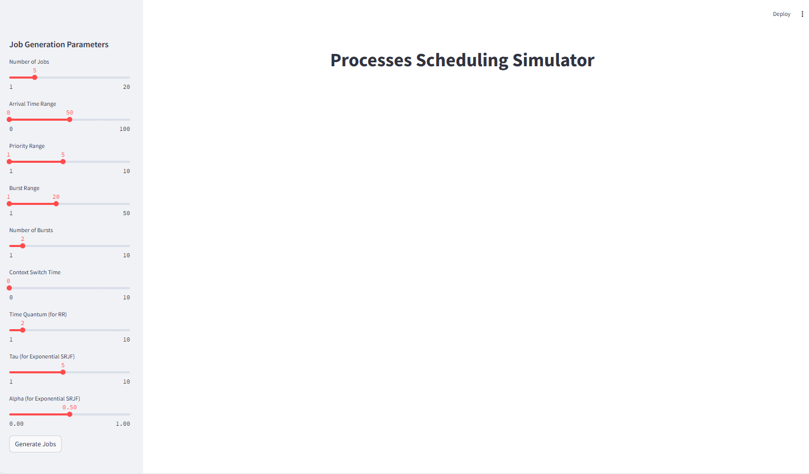
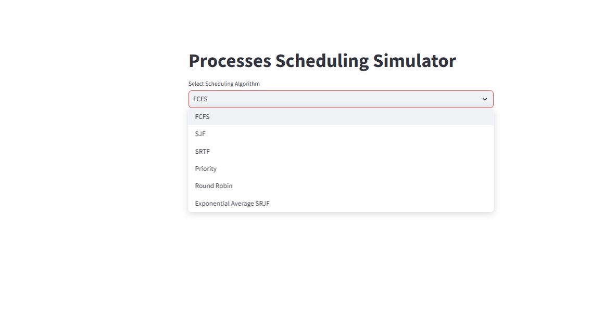
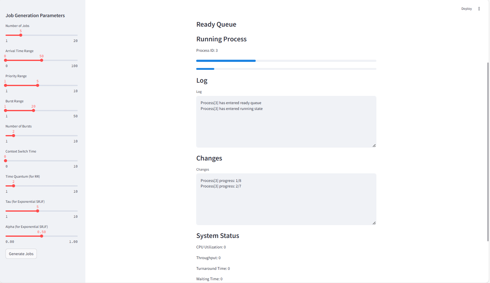

# process-scheduling-simulator

A simulator for operating system scheduling algorithms built with Python and Streamlit.

## Setup
```bash
git clone https://github.com/IamAbhinav01/process-scheduling-simulator.git
cd process-scheduling-simulator
pip install streamlit
streamlit run main.py


# 1. Project Overview
The Process Scheduling Simulator is an interactive tool designed to simulate operating system process scheduling algorithms, including First-Come-First-Serve (FCFS), Shortest Job First (SJF), Shortest Remaining Time First (SRTF), Priority Scheduling, Round Robin, and Exponential Average SRJF. Built using Python and Streamlit within a single file (main.py), the simulator allows users to generate random jobs with configurable parameters, select a scheduling algorithm, and visualize the scheduling process in real-time.

The interface, powered by Streamlit, displays the ready queue, running process, logs, changes, and system metrics, serving as an educational tool for understanding scheduling concepts. The project is hosted on a public GitHub repository with version control and detailed documentation.

## 2. Screenshots




## 3. Functionalities
    1) Job Generation:
    Configurable via Streamlit sliders (e.g., "Number of Jobs" = 5, "Arrival Time Range" = 0 to 50).
    Generates random jobs with the click of the "Generate Jobs" button.
    2) Scheduling Algorithms:
    Supports FCFS, SJF, SRTF, Priority, Round Robin, and Exponential Average SRJF, implemented within the Scheduler class.
    3) Simulation Control:
    Manual stepping with "Next Step" (one time unit) or "Next Change" (to the next event).
    Continuous animation with adjustable speed via the "Animation Speed" slider.
    4) Visualization:
    Displays the ready queue and running process with progress bars.
    Shows logs (e.g., "Process[1] has entered running state") and changes (e.g., "Process[1] progress: 2/8") in text areas.
    Provides system status (e.g., system time, currently placeholders for metrics).
    5) Interactivity:
    Fully interactive UI built with Streamlit, allowing real-time parameter adjustments and simulation control.
## 4. Conclusion and Future Scope
    Conclusion:
        The Process Scheduling Simulator, implemented in a single main.py file, effectively demonstrates operating system scheduling algorithms with an interactive Streamlit UI. The project provides real-time visualization and control, supported by a robust GitHub workflow for version control and documentation.

## Future Scope:
    Implement system metrics (e.g., CPU utilization) within main.py.
    Add a device queue for IO simulation.
    Integrate a comparison feature for algorithms.
    Enhance with AI (e.g., machine learning for dynamic scheduling).
    Improve UI with visualizations like a Gantt chart.
## 5. References
Streamlit Documentation
Operating System Concepts: Silberschatz, Galvin, and Gagne
GitHub Documentation


